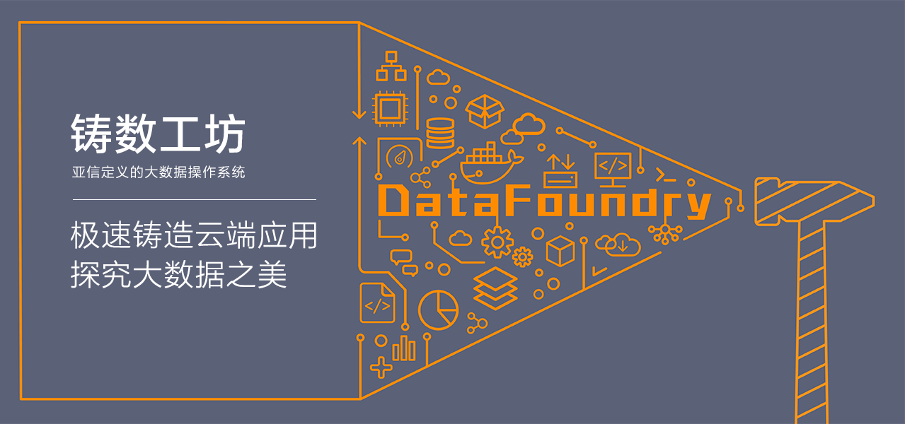

欢迎来到 DataFoundry （铸数工坊）！

DataFoundry 是亚信定义的大数据操作系统，我们为您提供：

* 即买即用的大数据服务能力

一站式大数据云服务和丰富的大数据服务组件，可助您在数十秒内即获得一个可扩展的弹性分布式大数据服务组件。支持多种数据应用场景，同时可满足数据迁移及开放的需求。

* 快速简单的大数据应用托管能力

一键实现应用代码的云端部署，得到一个灵活、可扩展、低成本的应用。同时利用容器服务的优势，可提供从开发、构建、测试、部署到运行的完整应用生命周期服务，并支持负载均衡、弹性伸缩、日志监控和灰度升级等特性。

* 合作共赢的应用生态

共同拓展、全面聚合优秀的应用，打造一个开放、合作、共赢的云端应用生态，为用户提供丰富且一致的应用体验。
