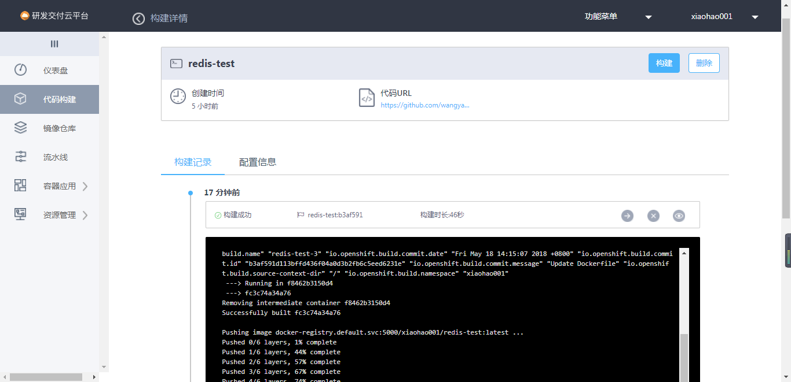
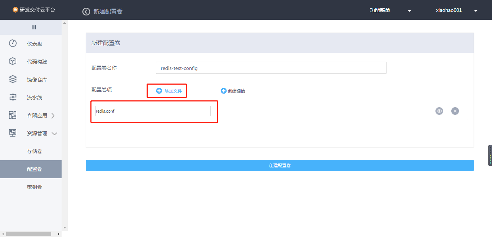
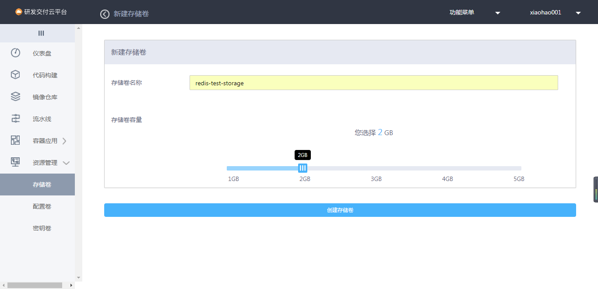
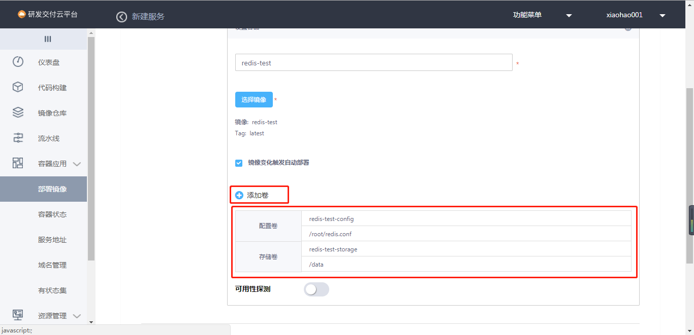
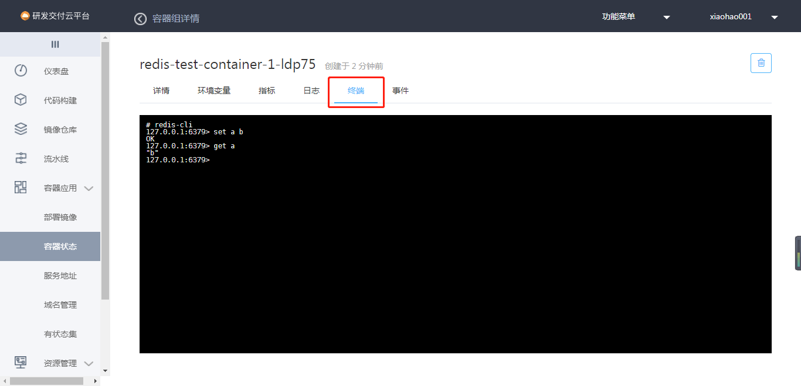
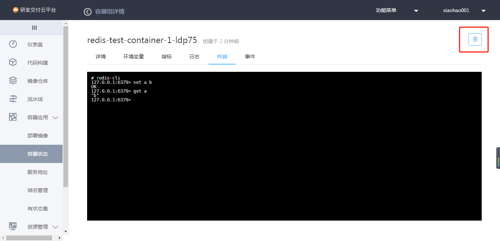
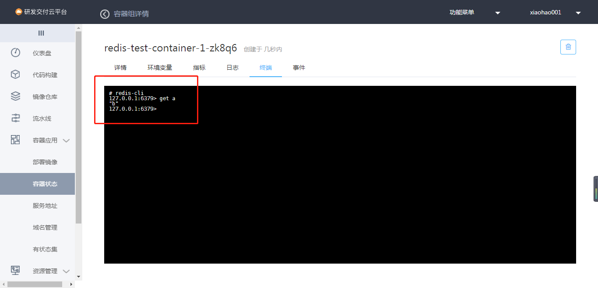
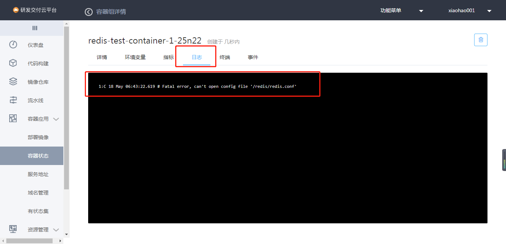

# 卷使用的实例

卷种类：
* 存储卷：将容器中的某一目录内容保留在存储卷中。容器重启会恢复镜像的初始状态，当我们需要保留某一目录下的文件内容需要用存储卷持久化该目录。
* 配置卷：用来存放单个或多个文件。将这些文件挂入到容器的文件夹目录。容器中某个文件需要修改时使用，免去了重新构建镜像的步骤。
* 密钥卷：使用方法上与配置卷相同，区别是，密钥卷的内容是加密的。

## 自定义配置持久化redis实例

我们通过redis简单来了解一下，存储卷和配置卷的使用。

### Dockerfile编写

我们制作一个简单的Dockerfile，让Redis通过/redis/redis.conf来启动redis服务。
```
FROM redis

CMD [ "redis-server", "/redis/redis.conf" ]
```


### 构建镜像


### 创建配置卷


### 创建存储卷


### 部署镜像并使用存储卷和配置卷


### 测试存储卷
* 写入数据

* 删除容器

* 进入新创的容器查询



### 若缺少配置卷，容器日志会有提示。


### 若缺少存储卷，删除容器后查询不到数据。