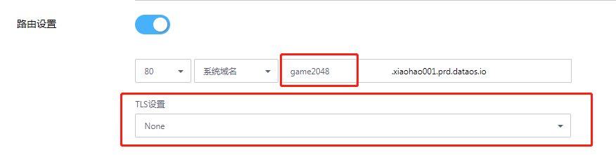

# 应用部署

## 镜像选择

* ### 构建的镜像
通过代码库构建成功的镜像。

* ### 公共镜像
如果没有构建镜像，也可以直接到公共镜像库中选择镜像使用。

## 部署

如果无特殊要求，确定开放端口正确直接创建即可。

* ### 高级设置
  
  * 弹性伸缩  

    根据pod的cpu使用情况自动扩缩容pod的数量。  

    

  * 路由设置  
    
    设置应用对外访问的域名。路由可以是安全和不安全的，安全的路由包括以下TLS 类型:  
       
       Edge:使用集群的router组件的证书。  
       
       Passthrough:使用应用中的证书。  
       
       Re-encryption:同时使用Edge和Passthrough。 
       
       

  * 环境变量  
    
    设置使用的环境变量。
    
    

  * 自动部署  

    当镜像改变时，自动重新部署容器。
    
  * 配额限制  

    Pod所使用的CPU和内存。最小值为初始CPU和内存，最大值为Pod所能请求最大CPU和内存。
    
    

## 访问应用

## GAME START!

